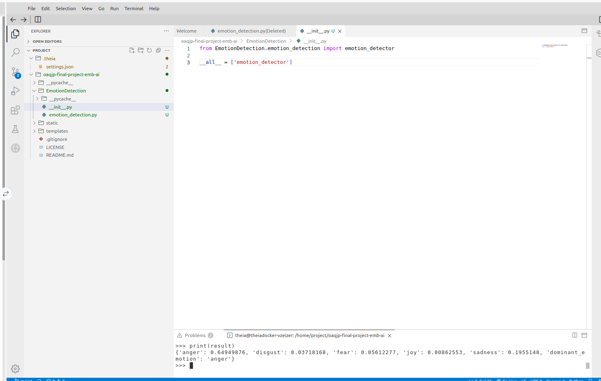

# Final project of *Flask Applications* from the Full-Stack IBM Developer Certification

## Scenario
You have been hired as a software engineer by an e-commerce company to create an AI-based web app that performs analytics on
customer feedback for their signature products. To accomplish this requirement, you will create an Emotion Detection system that
processes feedback provided by the customer in text format and deciphers the associated emotion expressed.
## Introduction
In this final project, you will be assessed on the knowledge gained on all aspects of app creation and its web deployment throughout this
course. You will be required to save screenshots of your results from time to time, with specific nomenclature. These screenshots will
have to be uploaded in the peer graded assignment that follows.
In this project, we use the embeddable Watson AI libraries to create an emotion detection application.
Emotion detection extends the concept of sentiment analysis by extracting the finer emotions, like joy, sadness, anger, and so on, from
statements rather than the simple polarity that sentiment analysis provides. This makes emotion detection a very important branch of
study and businesses use such systems widely for their AI based recommendation systems, automated chat bots, and so on.

## Evidence of Task's Completion through Screenshots

### Task 1: Fork and Clone the project repository

### Task 2: Create an emotion detection application using the

- 2a: write the function to run emotion detection using the appropriate Emotion Detection function.
Name this function emotion_detector

- 2b: Screenshot of the application creation

### Task 3: Format the output of the application

- 3a: Screenshot in order to show the modified code in order to address sentiment analysis.

- 3b: Output of the implemented sentiment analysis for the phrase:"I am so happy I am doing this".

### Task 4: Package the application

- 4a: Screenshot of the successfully created EmotionDetection.

- 4b: Screenshot of the test packaged by using a phrase: " I hate working long hours" and verifying that its output is **"anger"**.

### Task 5: Run unit tests on your application

- 5a: Screenshot of the following unit tests:
Create a new file, test_emotion_detection.py that calls the required application function from the package and
tests it for the following statements and dominant emotions.

| Statement | Dominant Emotion |
|-----------|-----------------|
| I am glad this happened | joy |
| I am really mad about this | anger |
| I feel disgusted just hearing about this |disgust |
| I am so sad about this | sadness |
| I am really afraid that this will happen | fear |

- 5b: Screenshot of the test_emotion_detection.py file on terminal, showing that the tests were successfully implemented.

### Task 6: Web deployment of the application using Flask

- 6a: Creation of the server.py file in order to deploy the Web App.

- 6b: Snapshot of the final deployed application, successfully testing it for the statement “I think I am having fun”.

### Task 7: Incorporate Error handling

- 7a: Modifying the main function in order to address error handling.

- 7b: Snapshot of the edited error handling function when the dominant emotion is **None**.

- 7c: Snapshot of the deployed application, displaying as a result “Invalid Text! Please try again!.“, when the dominant emotion is **None**.

### Task 8: Run static code analysis

- 8a: Modifying the server.py file in order to pass in the linting process by using PyLint.

- 8b: Snapshot of the static code analysis, showing that it ran successfully, scoring 10 of 10.

## Conclusions

By completing this project, I have successfully:

1. Created an Emotion Detection application using the functions from embeddable AI libraries;
2. Extracted relevant information from the output received from the function;
3. Tested and packaged the application created using the Emotion Detection function;
4. Completed web deployment of your application using Flask;
5. Incorporated error handling in your application to account for invalid input to your application;
6. Written codes that are in perfect compliance with PEP8 guidelines, getting 10/10 score in static code analysis.

# Contributor Covenant Code of Conduct

## Our Pledge

We as members, contributors, and leaders pledge to make participation in our
community a harassment-free experience for everyone, regardless of age, body
size, visible or invisible disability, ethnicity, sex characteristics, gender
identity and expression, level of experience, education, socio-economic status,
nationality, personal appearance, race, caste, color, religion, or sexual
identity and orientation.

We pledge to act and interact in ways that contribute to an open, welcoming,
diverse, inclusive, and healthy community.

## Our Standards

Examples of behavior that contributes to a positive environment for our
community include:

* Demonstrating empathy and kindness toward other contributions that are not aligned with this Code of Conduct, and will communicate reasons for moderation decisions when appropriate.

## Scope

This Code of Conduct applies within all community spaces, and also applies when
an individual, or aggression toward or disparagement of classes of individuals.

**Consequence**: A permanent ban from any sort of public interaction within the
community.

## Attribution

This Code of Conduct is adapted from the [Contributor Covenant][homepage],
version 2.1, available at
[https://www.contributor-covenant.org/version/2/1/code_of_conduct.html][v2.1].

Community Impact Guidelines were inspired by
[Mozilla's code of conduct enforcement ladder][Mozilla CoC].

For answers to common questions about this code of conduct, see the FAQ at
[https://www.contributor-covenant.org/faq][FAQ]. Translations are available at
[https://www.contributor-covenant.org/translations][translations].

[homepage]: https://www.contributor-covenant.org
[v2.1]: https://www.contributor-covenant.org/version/2/1/code_of_conduct.html
[Mozilla CoC]: https://github.com/mozilla/diversity
[FAQ]: https://www.contributor-covenant.org/faq
[translations]: https://www.contributor-covenant.org/translations is officially representing the community in public spaces.
Examples of representing our community include using an official e-mail address,
posting via an official social media account, or acting as an appointed
representative at an online or offline event.

## Enforcement

Instances of abusive, harassing, or otherwise unacceptable behavior may be
reported to the community leaders responsible for enforcement at
[INSERT CONTACT METHOD].
All complaints will be reviewed and investigated promptly and fairly.

All community leaders are obligated to respect the privacy and security of the
reporter of any incident.

## Enforcement Guidelines

Community leaders will follow these Community Impact Guidelines in determining
the consequences for any action they deem in violation of this Code of Conduct:

### 1. Correction

**Community Impact**: Use of inappropriate language or other behavior deemed
unprofessional or unwelcome in the community.

**Consequence**: A private, written warning from community leaders, providing
clarity around the nature of the violation and an explanation of why the
behavior was inappropriate. A public apology may be requested.

### 2. Warning

**Community Impact**: A violation through a single incident or series of
actions.

**Consequence**: A warning with consequences for continued behavior. No
interaction with the people involved, including unsolicited interaction with
those enforcing the Code of Conduct, for a specified period of time. This
includes avoiding interactions in community spaces as well as external channels
like social media. Violating these terms may lead to a temporary or permanent
ban.

### 3. Temporary Ban

**Community Impact**: A serious violation of community standards, including
sustained inappropriate behavior.

**Consequence**: A temporary ban from any sort of interaction or public
communication with the community for a specified period of time. No public or
private interaction with the people involved, including unsolicited interaction
with those enforcing the Code of Conduct, is allowed during this period.
Violating these terms may lead to a permanent ban.

### 4. Permanent Ban

**Community Impact**: Demonstrating a pattern of violation of community
standards, including sustained inappropriate behavior, harassment of an
individual people
* Being respectful of differing opinions, viewpoints, and experiences
* Giving and gracefully accepting constructive feedback
* Accepting responsibility and apologizing to those affected by our mistakes,
  and learning from the experience
* Focusing on what is best not just for us as individuals, but for the overall
  community

Examples of unacceptable behavior include:

* The use of sexualized language or imagery, and sexual attention or advances of
  any kind
* Trolling, insulting or derogatory comments, and personal or political attacks
* Public or private harassment
* Publishing others' private information, such as a physical or email address,
  without their explicit permission
* Other conduct which could reasonably be considered inappropriate in a
  professional setting

## Enforcement Responsibilities

Community leaders are responsible for clarifying and enforcing our standards of
acceptable behavior and will take appropriate and fair corrective action in
response to any behavior that they deem inappropriate, threatening, offensive,
or harmful.

Community leaders have the right and responsibility to remove, edit, or reject
comments, commits, code, wiki edits, issues, and other